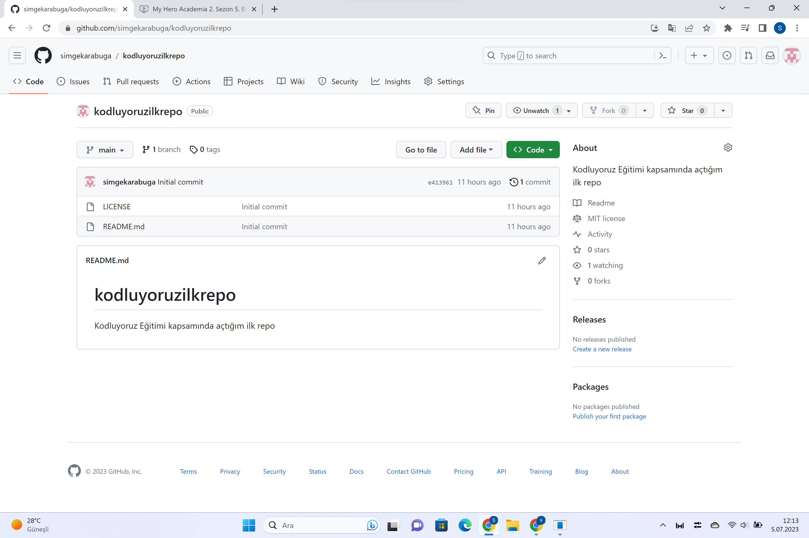

# kodluyoruzilkrepo
Bu repo [kodluyoruz](https://kodluyoruz.org/) front-End Eğitiminde oluşturduğumuz ilk repo.İçerisinde bir adet README ve bir adet index.html barındırıyor.

  
## Installation
----
Öncelikle projeyi clonlayın.(Buraya sizin reponuzdan aldığınız link gelecek.)

https://github.com/simgekarabuga/kodluyoruzilkrepo.git

## Usage
----
Projeyi clonladıktan sonra Visual Studio Code programında açınız.
Linux için:
cd kodluyoruzilkrepo
code .
## Contributing
----
Pull requestler kabul edilir. Büyük değişiklikler için, lütfen önce neyi değiştirmek istediğinizi tartışmak için bir konu açınız.
##License
---
[MIT](https://choosealicense.com/licenses/mit/)
